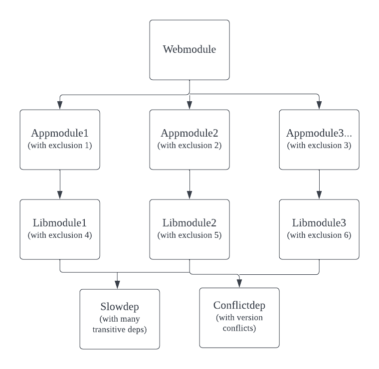

# Background

This is a maven project to demonstrate the maven resolver slowness when comes to resolve duplicate dependencies (same GAV) with different exclusions or version conflict dependencies. 

Dependencies are messy in this project, it is not the real code, however the cases being demoed here are real:

* Dependencies may get more and more complex with large number of transitive dependencies
* Version conflcits could be common
* Exclusions are scattered everywhere to solve conflicts.

I have to admit there is no such issue among opensource projects, however it should be common in a company where 

* Many developers are not Maven experts
* Tech stack evolves however many legacy libraries still base on old stack
* Home made tech stack
* Micro service tech not employed, teams are using maven dependencies to use APIs/Features provided by other teams. 

# Structure

The project is composed of:
* one web module 
* 5 app modules 
* 5 lib modules 
* one heavy dependency named as **Slowdep** (with many transitive dependencies) 
* one dependency named as **Conflictdep** that has version conflicts with **Slowdep** 

Note: below digram shows only part of the app/lib modules.

# Performance Test

## How to test
* clone the project, run mvn clean install
* run "mvn clean package" without the patch
* run "mvn clean package" with the patch

## Test result

w/ patch  | Total time
------------- | -------------
Without patch  | 17s ~ 21s
with BFS + Skipper patch  | 13s ~ 16s
